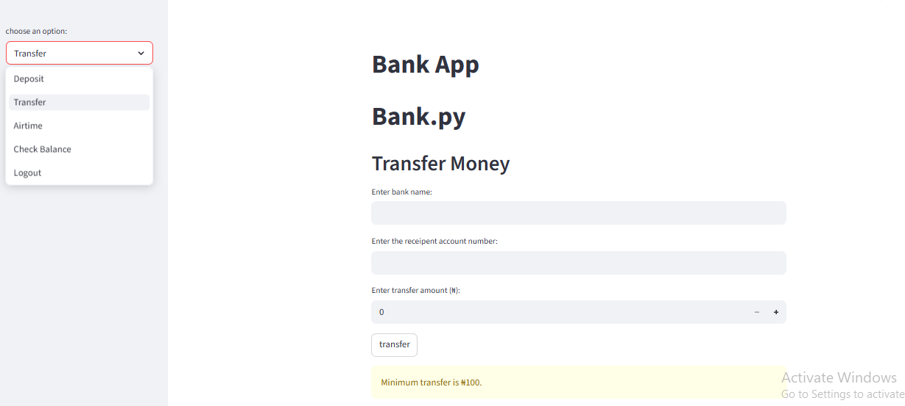

# 🏦 Bank App

A simple banking simulation application built with **Streamlit**, **Python**, and **Object-Oriented Programming (OOP)** concepts for performing basic banking operations such as deposits, transfers, airtime purchases, and balance checks through an interactive dashboard.

🔗 **Live App:** https://k-bank-app.streamlit.app/

---

## 📌 Project Overview

The **Bank App** is a beginner-friendly financial application designed to simulate core banking operations in a web-based environment.

The system allows users to:

- Deposit money  
- Transfer funds  
- Buy airtime  
- Check account balance  
- Logout securely  

The application demonstrates the practical implementation of:

- Python Classes  
- Object-Oriented Programming  
- Conditional Logic  
- Streamlit UI Development  

---

## 🚀 Features

### 💰 Deposit Function

Users can:

- Enter deposit amount  
- Enter account number  
- Add money to account balance  

The system instantly updates the balance after successful deposit.

---

### 🔄 Transfer Function

Users can:

- Enter bank name  
- Enter recipient account number  
- Enter transfer amount  

The app validates:

- Insufficient balance  
- Minimum transfer amount  
- Incorrect PIN  

before processing transfers.

---

### 📱 Airtime Purchase

Users can buy airtime by entering:

- Mobile network  
- Airtime amount  
- Security PIN  

The balance updates automatically after purchase.

---

### 💳 Balance Check

Displays current account balance instantly.

---

### 🚪 Logout Function

Allows users to exit the banking session safely.

---

### ⚡ Interactive Streamlit Interface

The application uses Streamlit components including:

- Sidebar navigation  
- Input forms  
- Buttons  
- Success/Error alerts  
- Real-time balance updates  

---

## 🖼️ App Screenshot

### Dashboard



---

## 📝 Dashboard Explanation

The **Bank App Dashboard** is an interactive financial simulation interface designed for performing basic banking transactions.

### 🎛️ Sidebar Navigation

The sidebar serves as the control panel for banking operations.

Users can navigate between:

- Deposit  
- Transfer  
- Airtime  
- Check Balance  
- Logout  

This structure makes the application simple and beginner-friendly.

---

### 💰 Deposit Module

Users can:

- Enter deposit amount  
- Input account number  
- Deposit funds into account  

After successful transaction, the system displays:

- Success notification  
- Updated account balance  

---

### 🔄 Transfer Module

The transfer interface enables users to send money to another account.

Validation checks include:

- Sufficient balance  
- Minimum transfer amount  
- Correct PIN verification  

This simulates real banking transaction logic.

---

### 📱 Airtime Purchase Module

Users can purchase airtime directly from their account balance.

The system deducts airtime amount automatically after PIN confirmation.

---

### 💳 Balance Inquiry

Displays current account balance instantly without additional calculations.

---

### ⚡ User Interface Design

The dashboard features:

- Clean layout  
- Sidebar-based navigation  
- Responsive user inputs  
- Interactive notifications  
- Beginner-friendly design  

---

### 📌 Benefits of the Application

- Demonstrates Python OOP concepts  
- Simulates core banking operations  
- Beginner-friendly financial application  
- Shows practical Streamlit development  
- Useful for learning CRUD-style logic and app design  

---

### 🧾 Summary

This application functions as a mini **digital banking simulator**, combining financial transaction logic with an interactive web dashboard.

---

## 🛠️ Tech Stack

- Python  
- Streamlit  
- Pandas  
- NumPy  
- Object-Oriented Programming (OOP)  

---

## 📂 Project Structure

```bash
Bank-App/
│── assets/
│   └── Dashboard.png
│── Bank.py
│── requirements.txt
---
⚙️ Installation & Setup
1️⃣ Clone Repository
```bash
git clone https://github.com/kola56de/Bank-App.git
cd Bank-App
```
---
2️⃣ Install Dependencies
```bash
pip install -r requirements.txt
```
---
3️⃣ Run Application
```bash
streamlit run Bank.py
```
---
## 📌 Use Cases

- Beginner Banking Applications  
- Financial Transaction Simulations  
- Python OOP Practice Projects  
- Streamlit Dashboard Applications  
- Educational FinTech Projects  
- Interactive Python Learning Systems  

---

## 📈 Future Improvements

- User Authentication System  
- Database Integration  
- Transaction History  
- ATM Card Simulation  
- Mobile Banking Features  
- Cloud Deployment with Secure Sessions  

---

## 👨‍💻 Author

**Kolade Olonisakin**  
PhD Civil Engineer | Transportation & Traffic Systems | AI & Machine Learning for Smart Mobility | Builder of Intelligent Data Applications  

---

## ⭐ Support

If you like this project, kindly **star the repository** and share.
---
